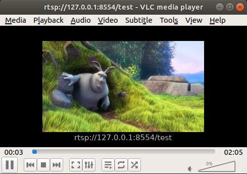

# rtsp-server

Original blogpost at https://medium.com/@pratik.mungekar/stream-video-using-gstreamer-rtsp-server-ca498f4a54bd

## Building docker image

```
docker build -t rtsp-file-test .
```

## Running it

The filepath need `/host` in front since we added the whole `/` as a volume. On the host the sample video will be located at `/home/user/Downloads/sample-mp4-file.mp4`

```sh
docker run --rm -v /:/host -p 8554:8554 rtsp-file-test /host/home/user/Downloads/sample-mp4-file.mp4
```

Console output :
```
...
stream ready at rtsp://127.0.0.1:8554/test
```


To view the stream, vlc can be used with the provided URL (`rtsp://127.0.0.1:8554/test`)

